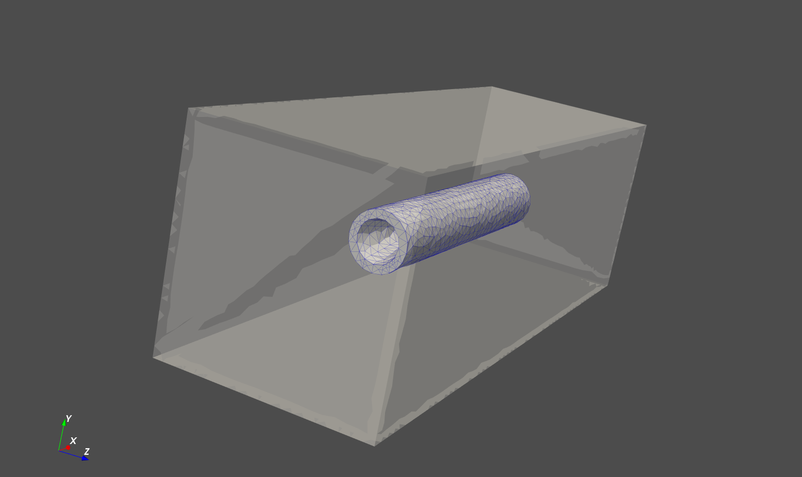

# PyFEA

Christophe Foyer 2019 | [www.cfoyer.com](https://www.cfoyer.com)

__Note:__ PyFEA is currently in the early stages of development and will evolve significantly over the course of the next few months.

## About
PyFEA is built to be an extendable suite for FE analysis in python, as this is a work in progress, no real documentation is currently provided but examples will be added to the examples folder as they are created. 
The focus will be on explicit FEM applied to transient simulations (and therefore will support steady-state, albeit at a maybe larger computational time).

## Current progress
- Interface with the [gmsh api](https://gitlab.onelab.info/gmsh/gmsh/blob/master/api/gmsh.py) for meshing
- Interface with [tetgen](https://github.com/pyvista/tetgen/tree/master/tetgen) for meshing (basic functionality only)
- Generating meshes from STP and STL files

  
## To Do
- [Done]~~Improve neighboring cell finder performance~~
- [In progress] Create easy way to interact with elements and set up multi-sim problems
- Support multiphysics extensions
- Support netgen for meshing
- Fix interface (outer faces) between entitymeshes in assemblies

## Dependencies
### Required:
- numpy
- pyvista
- tensorflow
- [gmsh](https://gmsh.info/)

### Optional:
- Interfaces with [AeroSandbox](https://github.com/peterdsharpe/AeroSandbox) (WIP)
- [tetgen](https://github.com/pyvista/tetgen/tree/master/tetgen) (currently inferior to gmsh)

______

### [Documentation (WIP)](http://pyfea.cfoyer.com/docs/build/html/index.html)

______

### MIT License

Copyright © 2019 Christophe Foyer

Permission is hereby granted, free of charge, to any person obtaining a copy
of this software and associated documentation files (the "Software"), to deal
in the Software without restriction, including without limitation the rights
to use, copy, modify, merge, publish, distribute, sublicense, and/or sell
copies of the Software, and to permit persons to whom the Software is
furnished to do so, subject to the following conditions:

The above copyright notice and this permission notice shall be included in all
copies or substantial portions of the Software.

The software is provided "As is", without warranty of any kind, express or
Implied, including but not limited to the warranties of merchantability,
Fitness for a particular purpose and noninfringement. In no event shall the
Authors or copyright holders be liable for any claim, damages or other
Liability, whether in an action of contract, tort or otherwise, arising from,
Out of or in connection with the software or the use or other dealings in the
Software.
