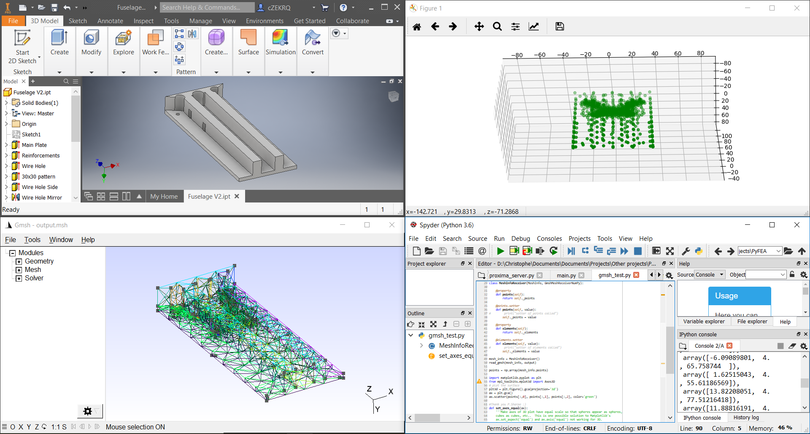

# PyFEA

Christophe Foyer 2019 | [www.cfoyer.com](https://www.cfoyer.com)

__Note:__ This is still very much a work in progress and will evolve significantly over the course of the next few months

## About
A start to setting up a coherent library for FEA using python. 
Hoping to make this somewhat pleasant to use eventually, and to model a few things using the mesh.

## Current progress
- Interface with the [gmsh api](https://gitlab.onelab.info/gmsh/gmsh/blob/master/api/gmsh.py) directly (for better support)
- Generating meshes from STP files
- Generating meshes from STL files

## To Do
- Efficiently order data to support irregular/sparse matrices (ideally with numpy compatibility)
- Create easy way to interact with elements and set up multi-sim problems

______

### MIT License

Copyright © 2019 Christophe Foyer

Permission is hereby granted, free of charge, to any person obtaining a copy
of this software and associated documentation files (the "Software"), to deal
in the Software without restriction, including without limitation the rights
to use, copy, modify, merge, publish, distribute, sublicense, and/or sell
copies of the Software, and to permit persons to whom the Software is
furnished to do so, subject to the following conditions:

The above copyright notice and this permission notice shall be included in all
copies or substantial portions of the Software.

The software is provided "As is", without warranty of any kind, express or
Implied, including but not limited to the warranties of merchantability,
Fitness for a particular purpose and noninfringement. In no event shall the
Authors or copyright holders be liable for any claim, damages or other
Liability, whether in an action of contract, tort or otherwise, arising from,
Out of or in connection with the software or the use or other dealings in the
Software.
